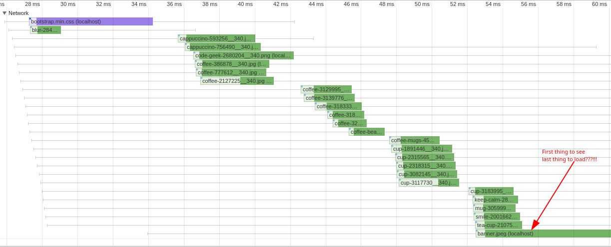

Core Web Vitals created a lot of noise since introduced last year. Google is going to use new set of metrics while ranking websites. It will all start in June (check) and if your website has a good User Experience then you would expect a boost in your organic search.

In this article, I would like to show how you could improve user experience of your pages by making simple changes to the hero banner. I think it's important to make sure your main image loads as fast as possible because this is the very first impression a visitor will make of your website.

The blog is structure as a step by step guide where we will start from the basic implementation of the hero banner using CSS background image and will improve it with one technique at a time. On each step we will measure performance metrics and see how they improve or degrade.

The source code of the example I'm using is in GitHub repo here: [TODO](). It's hosted on the [GitHub pages](TODO) where we made all the measurements. Each iteration has it's own git tag, so you can switch back and forth and observe all the changes.

## How we measured

One of the most popular tools to measure Core Web Vitals in the lab setup is [Lighthouse](). It's easy to use because it's available in the Chrome Developer Tools. In the output you got all important metrics.

[Video]

We also used "Performance" section of the Chrome Developer Tools to measure Core Web Vitals with Network throttling.

[Video]

We use two different methods to make sure our measurements are correct and tools are working properly.

## Metrics

* Largest Contentful Paint
* First Input Delay (Total Blocking Time)
* Cumulative Layout Shift

Before I started writing this blog, I thought that one of the metrics that hero banner performance will affect will be "Cumulative Layout Shift". However, I must admin I was wrong. I tried all the things with the image but the content under it didn't move a pixel! I think, the reason is being that when Chrome starts loading the image the dimension of the images are located at the very beginning of the file, so it can calculate the space the image needs on the page. Cheeky bugger!

## v1. Background image

[Source code]()

One of the most popular way to implement hero banner is to use CSS background image with `background-size` property set to `cover`. It is very straightforward and easy to do

```html
<div class="banner">
  <div class="banner-overlay">
    <p class="h1 display-4">Find Your Coffee Cup</p>
    <p class="lead">We have them all in one place!</p>
  </div>
</div>
```

```css
.banner {
  background-image: url('/hero-banner-demo/assets/banner.jpeg');
  background-size: cover;
  height: 600px;
  /*The above is the minimum you need*/
  width: 100%;
  display: flex;
  flex-direction: column;
  align-items: center;
}
```

However, there is a one big drawback here. Let's have a look at our Network section in Performance tool:



As you could see all the product images start loading before the hero banner which is not what we planned for really. 

This is happens because of the way browsers render the page and applying the styles. 

TODO from here:
    https://developer.mozilla.org/en-US/docs/Learn/CSS/First_steps/How_CSS_works

So, the CSS background images would always load after  elements which is not really what we would like to see. 

Let's fix it and replace background CSS image with  tag

## v.2 Load image using  element


