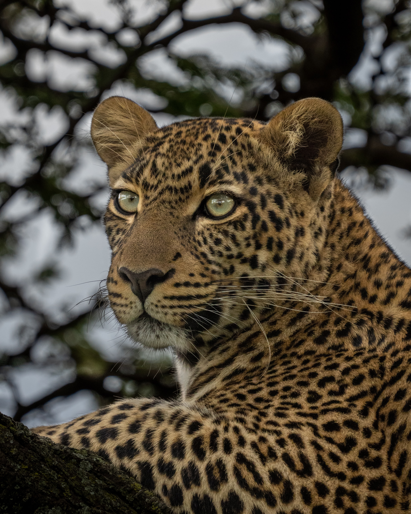

## Intro

Over the last decade, we’ve gone from having a home PC to having a pocket PC that can access the internet everywhere. It
came with plenty of freedom and new problems to solve. For example, we had to figure out how to present content on
different screens.

This was answered through responsive design, meaning that we could rely on one codebase with adaptive layouts depending
on the output device. Say you had a website with a large image for desktop computers that you wanted to display on
mobile devices with smaller screens.

When you write HTML code you could use the srcset attribute on the image tag or a picture tag. Subsequently, the same
image would be available in different sizes, and the browser would select the appropriate version.

However, the problems don’t stop at adapting to different screen sizes. There’s another characteristic called DPI. Let’s
discuss this concept in detail using this photo of a gorgeous cheetah to remind us how quickly we would like our images
to load.



Photo by <a href="https://unsplash.com/@ahmadgalal?utm_source=unsplash&utm_medium=referral&utm_content=creditCopyText">
Ahmed Galal</a>
on <a href="https://unsplash.com/s/photos/cheetah?utm_source=unsplash&utm_medium=referral&utm_content=creditCopyText">
Unsplash</a>

## What is DPI

DPI stands for “Dots Per Inch.” Initially, this term was mostly used to refer to an attribute of devices that put
digital images onto paper and vice versa. These included scanners and printers. Therefore, DPI wasn’t a big concern for
web content.

However, in 2010, Apple released the iPhone 4 with a Retina display. The main goal of that display was to make the
output on the screen look closer to an actual photo and remove pixelation. The image below shows the clear difference
between the Retina and non-retina display.









[Images from Wikipedia](https://en.wikipedia.org/wiki/Retina_display)

### What was the significant change here?

Before the Retina display, you could refer to a device’s screen resolution to determine how wide your page or other
content to be displayed should be. But with the advent of Retina display, the pixel now has two interpretations;
hardware pixels and software pixels (CSS pixels).

Device manufacturers choose how many hardware pixels go into a CSS pixel, and this attribute is known as the device
pixel ratio. For example, the Apple Retina display had a device pixel ratio of 2, meaning that one CSS pixel was equal
to four hardware pixels (2 pixels in height and 2 in width).

The Galaxy S4 then took it up a notch with a device pixel ratio of 3, meaning one CSS pixel was equal to nine hardware
pixels (3 in height and 3 in width). LG then dropped the G3 with a device pixel ratio of 4, which Samsung also adopted
with the Galaxy S6.

We should remember that a CSS pixel is designed to result in the same size when the same content is being displayed on
different devices with the same screen dimensions. Therefore, their differing device pixel ratios are responsible for
the slight variations in the similarly sized content.

These variations manifest in the form of sharper text and icons, which you can easily notice at the edges of the
characters and objects or any other part where contrasting colors border each other. The web browser will automatically
render the content to output a suitable result in each case.

## Support for DPI in HTML

There are two standard ways of accommodating your HTML markup for high DPI screens when using a  tag with the
srcset attribute.
The first option is to use the DPI (`x`) descriptor when specifying the URL:

```html

```

In the example above, the image will have the same screen size on all devices, and a browser will pick the one that
matches the user’s screen DPI. But what if we need an image to have different sizes on different screens? Say you want
to have full width on mobile and 400px on the desktop.

In that case, we would need to go with the width descriptor in the `srcset` attribute:

```html

```

Notice how many sizes we included? That’s because mobile devices are different in size and also in DPI. So for a
400px-wide screen, we would need to have three images; 400px, 800px and 1200px. A browser will work its magic to pick
the appropriate image based on the visible image size, display characteristics and other factors.

By the way, picking the sizes for srcset can be quite tricky. On the one hand, you could look up devices or screen sizes
using analytics tools and target them directly. You may find sizes like 390px wide for the iPhone 12, 393px for the
Pixel 5 and 375px for the iPhone SE, among others.

However, this approach comes with some drawbacks. Firstly, you’d need to update sizes whenever a new device is released
and becomes popular, which can be quite the hassle. Secondly, having too many variants could decrease your CDN cache hit
ratio, meaning you won’t be leveraging the full power of network edges.

So rather than going with specific devices, we recommend sticking with ranges like 400, 500 and 600 pixels. If we open
the Chrome web browser with the Developer console and select Samsung or iPhone 12 Pro, we will see that the browser will
load the 1200 pixels version because the screen DPI is 3.


<video src="devices-dpi.webm" autoplay mute controls></video>


If we change the device to iPhone SE, the browser will opt for the 800 pixels version. On that note, let’s have a look
at the sizes of the images loaded for 1, 2 and 3 DPI:

* cheetah-400w.jpg - 42 Kb
* cheetah-800w.jpg - 141 Kb
* cheetah-1200w.jpg - 298 Kb

Therefore, upon loading an image on a higher DPI display, the size of the image will also increase. This becomes a
bigger concern when we understand that high DPI displays are often mobile devices on networks that might not always be
as good as home broadband. So how can we make images load faster in such cases?

## Delivering smaller images for High DPI screens

When discussing images, their sizes and the bandwidth used, it is crucial to understand what happens when you display
the bigger image (1200px) on a smaller physical screen (400 screen pixels). The quality improves, as seen in the example
from the intro.

However, there’s only so much detail the human eye can see when it comes to photos. Consequently, we can use more
aggressive compression for displays with higher DPIs. So let’s encode our 3x variant with lower quality.

The 3x version is 154Kb, which is still greater than the 1x, but two times smaller than the original version. So, now
that we know what we’d like to achieve, here’s how to proceed:

Load the larger version of the image on high DPI displays, but use lower quality. Unfortunately, this isn’t possible to
implement with the  tag at the moment. This is because we can’t mix w and x descriptors; otherwise, we’d do
something like https://website.com/images/logo-800w-2x.png, with 800w and 2x in the srcset attribute to tell the browser
what image to load.

Instead, we can use the `<picture>` tag with media selectors. Fortunately, there’s
a [resolution CSS media selector](https://developer.mozilla.org/en-US/docs/Web/CSS/@media/resolution) that we can use in
this manner. But it may not be that easy, seeing as browsers like Safari still don’t support it. Nevertheless, there’s a
similar solution known as
the [–webkit-device-pixel-ratio selector](https://developer.mozilla.org/en-US/docs/Web/CSS/@media/-webkit-device-pixel-ratio)
that is supported everywhere.

Accordingly, let’s take a look at how to combine it with the `srcset` attribute:

```html

<picture>
  <source
      media="(-webkit-min-device-pixel-ratio: 2) and (-webkit-max-device-pixel-ratio: 2.9999)"
      srcset="
            q50/cheetah-400w.jpg 400w,
            q50/cheetah-500w.jpg 500w,
            q50/cheetah-600w.jpg 600w,
            q50/cheetah-800w.jpg 800w,
            q50/cheetah-1000w.jpg 1000w,
            q50/cheetah-1200w.jpg 1200w,
            q50/cheetah-1500w.jpg 1500w,
            q50/cheetah-1800w.jpg 1800w
          "
      sizes="(max-width: 768px) 100vw, 400px"
  >
  <source
      media="(-webkit-min-device-pixel-ratio: 3)"
      srcset="
            q40/cheetah-400w.jpg 400w,
            q40/cheetah-500w.jpg 500w,
            q40/cheetah-600w.jpg 600w,
            q40/cheetah-800w.jpg 800w,
            q40/cheetah-1000w.jpg 1000w,
            q40/cheetah-1200w.jpg 1200w,
            q40/cheetah-1500w.jpg 1500w,
            q40/cheetah-1800w.jpg 1800w
          "
      sizes="(max-width: 768px) 100vw, 400px"
  >
  
</picture>
```

Now that looks better as we load lower quality images for screens with a DPI of 2 or 3, and even lower quality from 3
onwards. Nonetheless, I wouldn’t recommend this example in the production because it’s not
leveraging [next-generation formats](https://pixboost.com/blog/next-gen-avif-format/) like WebP and AVIF.

Now, that looks better, as we load lower quality image for screens with DPI 2 to 3 and even lower quality from 3 onwards

To add next-gen formats into the mix, we need to use the type attribute of the <source> tag and add a separate source
for every format. It’s important to remember that the browser will use the first source it can load, so we should start
with AVIF, then go to WebP, and lastly, JPEG.

```html

<picture>
  <source
      media="(-webkit-min-device-pixel-ratio: 2) and (-webkit-max-device-pixel-ratio: 2.9999)"
      type="image/avif"
      srcset="
            q50-avif/cheetah-400w.avif 400w,
            q50-avif/cheetah-500w.avif 500w,
            q50-avif/cheetah-600w.avif 600w,
            q50-avif/cheetah-800w.avif 800w,
            q50-avif/cheetah-1000w.avif 1000w,
            q50-avif/cheetah-1200w.avif 1200w,
            q50-avif/cheetah-1500w.avif 1500w,
            q50-avif/cheetah-1800w.avif 1800w
          "
      sizes="(max-width: 768px) 100vw, 400px"
  >
  <source
      media="(-webkit-min-device-pixel-ratio: 2) and (-webkit-max-device-pixel-ratio: 2.9999)"
      type="image/webp"
      srcset="
            q50-webp/cheetah-400w.webp 400w,
            q50-webp/cheetah-500w.webp 500w,
            q50-webp/cheetah-600w.webp 600w,
            q50-webp/cheetah-800w.webp 800w,
            q50-webp/cheetah-1000w.webp 1000w,
            q50-webp/cheetah-1200w.webp 1200w,
            q50-webp/cheetah-1500w.webp 1500w,
            q50-webp/cheetah-1800w.webp 1800w
          "
      sizes="(max-width: 768px) 100vw, 400px"
  >
  <source
      media="(-webkit-min-device-pixel-ratio: 2) and (-webkit-max-device-pixel-ratio: 2.9999)"
      srcset="
            q50/cheetah-400w.jpg 400w,
            q50/cheetah-500w.jpg 500w,
            q50/cheetah-600w.jpg 600w,
            q50/cheetah-800w.jpg 800w,
            q50/cheetah-1000w.jpg 1000w,
            q50/cheetah-1200w.jpg 1200w,
            q50/cheetah-1500w.jpg 1500w,
            q50/cheetah-1800w.jpg 1800w
          "
      sizes="(max-width: 768px) 100vw, 400px"
  >
  <source
      media="(-webkit-min-device-pixel-ratio: 3)"
      type="image/avif"
      srcset="
            q40-avif/cheetah-400w.avif 400w,
            q40-avif/cheetah-500w.avif 500w,
            q40-avif/cheetah-600w.avif 600w,
            q40-avif/cheetah-800w.avif 800w,
            q40-avif/cheetah-1000w.avif 1000w,
            q40-avif/cheetah-1200w.avif 1200w,
            q40-avif/cheetah-1500w.avif 1500w,
            q40-avif/cheetah-1800w.avif 1800w
          "
      sizes="(max-width: 768px) 100vw, 400px"
  >
  <source
      media="(-webkit-min-device-pixel-ratio: 3)"
      type="image/webp"
      srcset="
            q40-webp/cheetah-400w.webp 400w,
            q40-webp/cheetah-500w.webp 500w,
            q40-webp/cheetah-600w.webp 600w,
            q40-webp/cheetah-800w.webp 800w,
            q40-webp/cheetah-1000w.webp 1000w,
            q40-webp/cheetah-1200w.webp 1200w,
            q40-webp/cheetah-1500w.webp 1500w,
            q40-webp/cheetah-1800w.webp 1800w
          "
      sizes="(max-width: 768px) 100vw, 400px"
  >
  <source
      media="(-webkit-min-device-pixel-ratio: 3)"
      srcset="
            q40/cheetah-400w.jpg 400w,
            q40/cheetah-500w.jpg 500w,
            q40/cheetah-600w.jpg 600w,
            q40/cheetah-800w.jpg 800w,
            q40/cheetah-1000w.jpg 1000w,
            q40/cheetah-1200w.jpg 1200w,
            q40/cheetah-1500w.jpg 1500w,
            q40/cheetah-1800w.jpg 1800w
          "
      sizes="(max-width: 768px) 100vw, 400px"
  >
  
</picture>
```

And here it is! The snippet that will give us the best mix of quality and performance. It’s also worth mentioning that
there’s no javascript involved. The downside is that we would need to prepare 48 variants of the source image. This is
where an Image CDN can help.

## Using an Image CDN to reduce the number of source images

With Pixboost as an example, let’s see how to produce all the required variants using an Image Processing API. Firstly,
you’ll need to create a free account at Pixboost.com. Then, when you log in for the first time, add a new image source
as in the video below.


<video src="add-source-domain.webm" autoplay mute controls></video>


Now, you can use the /resize API to produce all the needed sizes and next-generation formats.

```html

```

The above code will cater to different sizes and next-generation formats by using the Accept header. A browser will send
a list of supported formats to the API, and Pixboost will choose the best one to use. The only missing part now is the
additional compression on screens with DPI >= 2. Finally, we have our new API feature; the ?dppx query parameter.

## API support for High DPI screens

The new `?dppx` hint passes the screen DPI to the API, so we can perform optimizations based on its value.

Having a `?ddpx` and not a direct quality gives us plenty of room to add more enhancements. We believe the end-user
doesn’t need direct access to those configurations, which would become harder to support in the long run. The most
recent example is the AVIF format that was introduced last year. It enables us to use much higher compression while
keeping the same level of visual perception. We can also use different quality and types of compression for various
kinds of images such as photos, illustrations and more.

To introduce `?dppx` support into our HTML code, we still need to use the `<picture>` tag with media queries. But just
like with the `` example, we don’t need to specify a separate `<source>` for the next-generation formats.

```html

<picture>
  <source
      media="(-webkit-min-device-pixel-ratio: 2) and (-webkit-max-device-pixel-ratio: 2.9999)"
      srcset="
        https://pixboost.com/api/2/img/http://www.midday.coffee/dppx-demo/cheetah.jpg/resize?size=400&dppx=2&auth=MTI0MjkwMTgzMA__ 400w,
        https://pixboost.com/api/2/img/http://www.midday.coffee/dppx-demo/cheetah.jpg/resize?size=500&dppx=2&auth=MTI0MjkwMTgzMA__ 500w,
        https://pixboost.com/api/2/img/http://www.midday.coffee/dppx-demo/cheetah.jpg/resize?size=600&dppx=2&auth=MTI0MjkwMTgzMA__ 600w,
        https://pixboost.com/api/2/img/http://www.midday.coffee/dppx-demo/cheetah.jpg/resize?size=800&dppx=2&auth=MTI0MjkwMTgzMA__ 800w,
        https://pixboost.com/api/2/img/http://www.midday.coffee/dppx-demo/cheetah.jpg/resize?size=1000&dppx=2&auth=MTI0MjkwMTgzMA__ 1000w,
        https://pixboost.com/api/2/img/http://www.midday.coffee/dppx-demo/cheetah.jpg/resize?size=1200&dppx=2&auth=MTI0MjkwMTgzMA__ 1200w,
        https://pixboost.com/api/2/img/http://www.midday.coffee/dppx-demo/cheetah.jpg/resize?size=1500&dppx=2&auth=MTI0MjkwMTgzMA__ 1500w,
        https://pixboost.com/api/2/img/http://www.midday.coffee/dppx-demo/cheetah.jpg/resize?size=1800&dppx=2&auth=MTI0MjkwMTgzMA__ 1800w
      "
      sizes="(max-width: 768px) 100vw, 400px"
  >
  <source
      media="(-webkit-min-device-pixel-ratio: 3)"
      srcset="
        https://pixboost.com/api/2/img/http://www.midday.coffee/dppx-demo/cheetah.jpg/resize?size=400&dppx=3&auth=MTI0MjkwMTgzMA__ 400w,
        https://pixboost.com/api/2/img/http://www.midday.coffee/dppx-demo/cheetah.jpg/resize?size=500&dppx=3&auth=MTI0MjkwMTgzMA__ 500w,
        https://pixboost.com/api/2/img/http://www.midday.coffee/dppx-demo/cheetah.jpg/resize?size=600&dppx=3&auth=MTI0MjkwMTgzMA__ 600w,
        https://pixboost.com/api/2/img/http://www.midday.coffee/dppx-demo/cheetah.jpg/resize?size=800&dppx=3&auth=MTI0MjkwMTgzMA__ 800w,
        https://pixboost.com/api/2/img/http://www.midday.coffee/dppx-demo/cheetah.jpg/resize?size=1000&dppx=3&auth=MTI0MjkwMTgzMA__ 1000w,
        https://pixboost.com/api/2/img/http://www.midday.coffee/dppx-demo/cheetah.jpg/resize?size=1200&dppx=3&auth=MTI0MjkwMTgzMA__ 1200w,
        https://pixboost.com/api/2/img/http://www.midday.coffee/dppx-demo/cheetah.jpg/resize?size=1500&dppx=3&auth=MTI0MjkwMTgzMA__ 1500w,
        https://pixboost.com/api/2/img/http://www.midday.coffee/dppx-demo/cheetah.jpg/resize?size=1800&dppx=3&auth=MTI0MjkwMTgzMA__ 1800w
      "
      sizes="(max-width: 768px) 100vw, 400px"
  >
  
</picture>
```

And now, we have the perfect snippet for showing responsive images on the website.

### Obsolete methods

Some time ago, there was an approach that relied on the screen DPR client hint to pick an image source, and the
Content-DPR header would confirm the image device pixel ratio in such requests.

Where the Content-DPR value differs from the DPR value (the screen DPR isn’t the same as the image DPR), the Content-DPR
would be used to ascertain the inherent image size and scale the image accordingly.

This approach used the most recent instance of the Content-DPR if the Content-DPR header appeared more than once in a
message. But over time, there was a lack of consensus around Content-DPR, with many not seeing image resolution as a
transport-level feature.

Therefore, the new approach was to specify the intrinsic resolution within the EXIF metadata. As we speak, Content-DPR
is no longer supported by many browsers, while others are in the process of dropping it, and a few have only kept it for
backward-compatibility reasons.

## Conclusion

The web changed a lot once we were able to use our phones, tablets, fridges and other devices to access the internet. To
deliver images with higher visual fidelity, we need to support screens with DPI > 2. However, for the internet to be
more accessible, we need to cater to people without fast connections by sending them only the data they need.

We can achieve this goal by using higher compression on High DPI screens. Additionally, using an Image CDN comes with
some practical long-term benefits such as:

* Making your processes more lightweight when storing only one source image
* Cleaning up your markup by removing the need for a separate source for the next-gen formats
* Future-proofing your image delivery with automatic support for new formats and features (it is vital to note that
  switching to formats like AVIF can enable you up to 80% more compression than JPEG offers without losing quality,
  which bodes well for your website’s performance)
* Content-sensitive compression - an Image CDN can automatically change the compression quality for each image based on
  what’s in the image. For example, images with fewer colors and less detail will be compressed a lot more than those
  that are rich in detail, color and other patterns. By doing so, you can strike the perfect middle-ground between
  quality and size for each image.

If you would like to discover the shortfalls in your web project’s image optimization and the extent to which they
diminish overall website speed, you can use Google PageSpeed insights and zoom in on PageDetox.

## Examples


<script type="text/javascript">
function showImageSource(event, outputId, includeFolder) {
    const currentSrc = event.target.currentSrc;
    const el = document.getElementById(outputId);
    
    if (includeFolder) {
        const pathElements = currentSrc.split('/');
        el.innerHTML = pathElements[pathElements.length - 2] + '/' + pathElements[pathElements.length - 1];
    } else {
        el.innerHTML = currentSrc.substring(currentSrc.lastIndexOf('/') + 1);
    }
}
</script>


### Using DPI descriptor

```html

```




<p>
    Source: <span id="example-dpi-descriptor"></span>
</p>



### Using width descriptors

```html

```



<p>
    Source: <span id="example-width-descriptor"></span>
</p>


### Picture tag

```html

<picture>
  <source
      media="(-webkit-min-device-pixel-ratio: 2) and (-webkit-max-device-pixel-ratio: 2.9999)"
      srcset="
            q50/cheetah-400w.jpg 400w,
            q50/cheetah-500w.jpg 500w,
            q50/cheetah-600w.jpg 600w,
            q50/cheetah-800w.jpg 800w,
            q50/cheetah-1000w.jpg 1000w,
            q50/cheetah-1200w.jpg 1200w,
            q50/cheetah-1500w.jpg 1500w,
            q50/cheetah-1800w.jpg 1800w
          "
      sizes="(max-width: 768px) 100vw, 400px"
  >
  <source
      media="(-webkit-min-device-pixel-ratio: 3)"
      srcset="
            q40/cheetah-400w.jpg 400w,
            q40/cheetah-500w.jpg 500w,
            q40/cheetah-600w.jpg 600w,
            q40/cheetah-800w.jpg 800w,
            q40/cheetah-1000w.jpg 1000w,
            q40/cheetah-1200w.jpg 1200w,
            q40/cheetah-1500w.jpg 1500w,
            q40/cheetah-1800w.jpg 1800w
          "
      sizes="(max-width: 768px) 100vw, 400px"
  >
  
</picture>
```


<picture>
  <source
      media="(-webkit-min-device-pixel-ratio: 2) and (-webkit-max-device-pixel-ratio: 2.9999)"
      srcset="
            q50/cheetah-400w.jpg 400w,
            q50/cheetah-500w.jpg 500w,
            q50/cheetah-600w.jpg 600w,
            q50/cheetah-800w.jpg 800w,
            q50/cheetah-1000w.jpg 1000w,
            q50/cheetah-1200w.jpg 1200w,
            q50/cheetah-1500w.jpg 1500w,
            q50/cheetah-1800w.jpg 1800w
          "
      sizes="(max-width: 768px) 100vw, 400px"
  >
  <source
      media="(-webkit-min-device-pixel-ratio: 3)"
      srcset="
            q40/cheetah-400w.jpg 400w,
            q40/cheetah-500w.jpg 500w,
            q40/cheetah-600w.jpg 600w,
            q40/cheetah-800w.jpg 800w,
            q40/cheetah-1000w.jpg 1000w,
            q40/cheetah-1200w.jpg 1200w,
            q40/cheetah-1500w.jpg 1500w,
            q40/cheetah-1800w.jpg 1800w
          "
      sizes="(max-width: 768px) 100vw, 400px"
  >
  
</picture>

<p>
    Source: <span id="example-picture"></span>
</p>


### Picture with next-gen formats

```html

<picture>
  <source
      media="(-webkit-min-device-pixel-ratio: 2) and (-webkit-max-device-pixel-ratio: 2.9999)"
      type="image/avif"
      srcset="
            q50-avif/cheetah-400w.avif 400w,
            q50-avif/cheetah-500w.avif 500w,
            q50-avif/cheetah-600w.avif 600w,
            q50-avif/cheetah-800w.avif 800w,
            q50-avif/cheetah-1000w.avif 1000w,
            q50-avif/cheetah-1200w.avif 1200w,
            q50-avif/cheetah-1500w.avif 1500w,
            q50-avif/cheetah-1800w.avif 1800w
          "
      sizes="(max-width: 768px) 100vw, 400px"
  >
  <source
      media="(-webkit-min-device-pixel-ratio: 2) and (-webkit-max-device-pixel-ratio: 2.9999)"
      type="image/webp"
      srcset="
            q50-webp/cheetah-400w.webp 400w,
            q50-webp/cheetah-500w.webp 500w,
            q50-webp/cheetah-600w.webp 600w,
            q50-webp/cheetah-800w.webp 800w,
            q50-webp/cheetah-1000w.webp 1000w,
            q50-webp/cheetah-1200w.webp 1200w,
            q50-webp/cheetah-1500w.webp 1500w,
            q50-webp/cheetah-1800w.webp 1800w
          "
      sizes="(max-width: 768px) 100vw, 400px"
  >
  <source
      media="(-webkit-min-device-pixel-ratio: 2) and (-webkit-max-device-pixel-ratio: 2.9999)"
      srcset="
            q50/cheetah-400w.jpg 400w,
            q50/cheetah-500w.jpg 500w,
            q50/cheetah-600w.jpg 600w,
            q50/cheetah-800w.jpg 800w,
            q50/cheetah-1000w.jpg 1000w,
            q50/cheetah-1200w.jpg 1200w,
            q50/cheetah-1500w.jpg 1500w,
            q50/cheetah-1800w.jpg 1800w
          "
      sizes="(max-width: 768px) 100vw, 400px"
  >
  <source
      media="(-webkit-min-device-pixel-ratio: 3)"
      type="image/avif"
      srcset="
            q40-avif/cheetah-400w.avif 400w,
            q40-avif/cheetah-500w.avif 500w,
            q40-avif/cheetah-600w.avif 600w,
            q40-avif/cheetah-800w.avif 800w,
            q40-avif/cheetah-1000w.avif 1000w,
            q40-avif/cheetah-1200w.avif 1200w,
            q40-avif/cheetah-1500w.avif 1500w,
            q40-avif/cheetah-1800w.avif 1800w
          "
      sizes="(max-width: 768px) 100vw, 400px"
  >
  <source
      media="(-webkit-min-device-pixel-ratio: 3)"
      type="image/webp"
      srcset="
            q40-webp/cheetah-400w.webp 400w,
            q40-webp/cheetah-500w.webp 500w,
            q40-webp/cheetah-600w.webp 600w,
            q40-webp/cheetah-800w.webp 800w,
            q40-webp/cheetah-1000w.webp 1000w,
            q40-webp/cheetah-1200w.webp 1200w,
            q40-webp/cheetah-1500w.webp 1500w,
            q40-webp/cheetah-1800w.webp 1800w
          "
      sizes="(max-width: 768px) 100vw, 400px"
  >
  <source
      media="(-webkit-min-device-pixel-ratio: 3)"
      srcset="
            q40/cheetah-400w.jpg 400w,
            q40/cheetah-500w.jpg 500w,
            q40/cheetah-600w.jpg 600w,
            q40/cheetah-800w.jpg 800w,
            q40/cheetah-1000w.jpg 1000w,
            q40/cheetah-1200w.jpg 1200w,
            q40/cheetah-1500w.jpg 1500w,
            q40/cheetah-1800w.jpg 1800w
          "
      sizes="(max-width: 768px) 100vw, 400px"
  >
  
</picture>
```


<picture>
  <source
      media="(-webkit-min-device-pixel-ratio: 2) and (-webkit-max-device-pixel-ratio: 2.9999)"
      type="image/avif"
      srcset="
            q50-avif/cheetah-400w.avif 400w,
            q50-avif/cheetah-500w.avif 500w,
            q50-avif/cheetah-600w.avif 600w,
            q50-avif/cheetah-800w.avif 800w,
            q50-avif/cheetah-1000w.avif 1000w,
            q50-avif/cheetah-1200w.avif 1200w,
            q50-avif/cheetah-1500w.avif 1500w,
            q50-avif/cheetah-1800w.avif 1800w
          "
      sizes="(max-width: 768px) 100vw, 400px"
  >
  <source
      media="(-webkit-min-device-pixel-ratio: 2) and (-webkit-max-device-pixel-ratio: 2.9999)"
      type="image/webp"
      srcset="
            q50-webp/cheetah-400w.webp 400w,
            q50-webp/cheetah-500w.webp 500w,
            q50-webp/cheetah-600w.webp 600w,
            q50-webp/cheetah-800w.webp 800w,
            q50-webp/cheetah-1000w.webp 1000w,
            q50-webp/cheetah-1200w.webp 1200w,
            q50-webp/cheetah-1500w.webp 1500w,
            q50-webp/cheetah-1800w.webp 1800w
          "
      sizes="(max-width: 768px) 100vw, 400px"
  >
  <source
      media="(-webkit-min-device-pixel-ratio: 2) and (-webkit-max-device-pixel-ratio: 2.9999)"
      srcset="
            q50/cheetah-400w.jpg 400w,
            q50/cheetah-500w.jpg 500w,
            q50/cheetah-600w.jpg 600w,
            q50/cheetah-800w.jpg 800w,
            q50/cheetah-1000w.jpg 1000w,
            q50/cheetah-1200w.jpg 1200w,
            q50/cheetah-1500w.jpg 1500w,
            q50/cheetah-1800w.jpg 1800w
          "
      sizes="(max-width: 768px) 100vw, 400px"
  >

  <source
      media="(-webkit-min-device-pixel-ratio: 3)"
      type="image/avif"
      srcset="
            q40-avif/cheetah-400w.avif 400w,
            q40-avif/cheetah-500w.avif 500w,
            q40-avif/cheetah-600w.avif 600w,
            q40-avif/cheetah-800w.avif 800w,
            q40-avif/cheetah-1000w.avif 1000w,
            q40-avif/cheetah-1200w.avif 1200w,
            q40-avif/cheetah-1500w.avif 1500w,
            q40-avif/cheetah-1800w.avif 1800w
          "
      sizes="(max-width: 768px) 100vw, 400px"
  >
  <source
      media="(-webkit-min-device-pixel-ratio: 3)"
      type="image/webp"
      srcset="
            q40-webp/cheetah-400w.webp 400w,
            q40-webp/cheetah-500w.webp 500w,
            q40-webp/cheetah-600w.webp 600w,
            q40-webp/cheetah-800w.webp 800w,
            q40-webp/cheetah-1000w.webp 1000w,
            q40-webp/cheetah-1200w.webp 1200w,
            q40-webp/cheetah-1500w.webp 1500w,
            q40-webp/cheetah-1800w.webp 1800w
          "
      sizes="(max-width: 768px) 100vw, 400px"
  >
  <source
      media="(-webkit-min-device-pixel-ratio: 3)"
      srcset="
            q40/cheetah-400w.jpg 400w,
            q40/cheetah-500w.jpg 500w,
            q40/cheetah-600w.jpg 600w,
            q40/cheetah-800w.jpg 800w,
            q40/cheetah-1000w.jpg 1000w,
            q40/cheetah-1200w.jpg 1200w,
            q40/cheetah-1500w.jpg 1500w,
            q40/cheetah-1800w.jpg 1800w
          "
      sizes="(max-width: 768px) 100vw, 400px"
  >

  
</picture>

<p>
    Source: <span id="example-picture-next-gen"></span>
</p>


### Responsive `` using pixboost

```html

```



<p>
    Source: <span id="example-pixboost-img"></span>
</p>


### Responsive image with DPI support using Pixboost

```html

<picture>
  <source
      media="(-webkit-min-device-pixel-ratio: 2) and (-webkit-max-device-pixel-ratio: 2.9999)"
      srcset="
        https://pixboost.com/api/2/img/http://www.midday.coffee/dppx-demo/cheetah.jpg/resize?size=400&dppx=2&auth=MTI0MjkwMTgzMA__ 400w,
        https://pixboost.com/api/2/img/http://www.midday.coffee/dppx-demo/cheetah.jpg/resize?size=500&dppx=2&auth=MTI0MjkwMTgzMA__ 500w,
        https://pixboost.com/api/2/img/http://www.midday.coffee/dppx-demo/cheetah.jpg/resize?size=600&dppx=2&auth=MTI0MjkwMTgzMA__ 600w,
        https://pixboost.com/api/2/img/http://www.midday.coffee/dppx-demo/cheetah.jpg/resize?size=800&dppx=2&auth=MTI0MjkwMTgzMA__ 800w,
        https://pixboost.com/api/2/img/http://www.midday.coffee/dppx-demo/cheetah.jpg/resize?size=1000&dppx=2&auth=MTI0MjkwMTgzMA__ 1000w,
        https://pixboost.com/api/2/img/http://www.midday.coffee/dppx-demo/cheetah.jpg/resize?size=1200&dppx=2&auth=MTI0MjkwMTgzMA__ 1200w,
        https://pixboost.com/api/2/img/http://www.midday.coffee/dppx-demo/cheetah.jpg/resize?size=1500&dppx=2&auth=MTI0MjkwMTgzMA__ 1500w,
        https://pixboost.com/api/2/img/http://www.midday.coffee/dppx-demo/cheetah.jpg/resize?size=1800&dppx=2&auth=MTI0MjkwMTgzMA__ 1800w
      "
      sizes="(max-width: 768px) 100vw, 400px"
  >
  <source
      media="(-webkit-min-device-pixel-ratio: 3)"
      srcset="
        https://pixboost.com/api/2/img/http://www.midday.coffee/dppx-demo/cheetah.jpg/resize?size=400&dppx=3&auth=MTI0MjkwMTgzMA__ 400w,
        https://pixboost.com/api/2/img/http://www.midday.coffee/dppx-demo/cheetah.jpg/resize?size=500&dppx=3&auth=MTI0MjkwMTgzMA__ 500w,
        https://pixboost.com/api/2/img/http://www.midday.coffee/dppx-demo/cheetah.jpg/resize?size=600&dppx=3&auth=MTI0MjkwMTgzMA__ 600w,
        https://pixboost.com/api/2/img/http://www.midday.coffee/dppx-demo/cheetah.jpg/resize?size=800&dppx=3&auth=MTI0MjkwMTgzMA__ 800w,
        https://pixboost.com/api/2/img/http://www.midday.coffee/dppx-demo/cheetah.jpg/resize?size=1000&dppx=3&auth=MTI0MjkwMTgzMA__ 1000w,
        https://pixboost.com/api/2/img/http://www.midday.coffee/dppx-demo/cheetah.jpg/resize?size=1200&dppx=3&auth=MTI0MjkwMTgzMA__ 1200w,
        https://pixboost.com/api/2/img/http://www.midday.coffee/dppx-demo/cheetah.jpg/resize?size=1500&dppx=3&auth=MTI0MjkwMTgzMA__ 1500w,
        https://pixboost.com/api/2/img/http://www.midday.coffee/dppx-demo/cheetah.jpg/resize?size=1800&dppx=3&auth=MTI0MjkwMTgzMA__ 1800w
      "
      sizes="(max-width: 768px) 100vw, 400px"
  >
  
</picture>
```


<picture>
  <source
      media="(-webkit-min-device-pixel-ratio: 2) and (-webkit-max-device-pixel-ratio: 2.9999)"
      srcset="
        https://pixboost.com/api/2/img/http://www.midday.coffee/dppx-demo/cheetah.jpg/resize?size=400&dppx=2&auth=MTI0MjkwMTgzMA__ 400w,
        https://pixboost.com/api/2/img/http://www.midday.coffee/dppx-demo/cheetah.jpg/resize?size=500&dppx=2&auth=MTI0MjkwMTgzMA__ 500w,
        https://pixboost.com/api/2/img/http://www.midday.coffee/dppx-demo/cheetah.jpg/resize?size=600&dppx=2&auth=MTI0MjkwMTgzMA__ 600w,
        https://pixboost.com/api/2/img/http://www.midday.coffee/dppx-demo/cheetah.jpg/resize?size=800&dppx=2&auth=MTI0MjkwMTgzMA__ 800w,
        https://pixboost.com/api/2/img/http://www.midday.coffee/dppx-demo/cheetah.jpg/resize?size=1000&dppx=2&auth=MTI0MjkwMTgzMA__ 1000w,
        https://pixboost.com/api/2/img/http://www.midday.coffee/dppx-demo/cheetah.jpg/resize?size=1200&dppx=2&auth=MTI0MjkwMTgzMA__ 1200w,
        https://pixboost.com/api/2/img/http://www.midday.coffee/dppx-demo/cheetah.jpg/resize?size=1500&dppx=2&auth=MTI0MjkwMTgzMA__ 1500w,
        https://pixboost.com/api/2/img/http://www.midday.coffee/dppx-demo/cheetah.jpg/resize?size=1800&dppx=2&auth=MTI0MjkwMTgzMA__ 1800w
      "
      sizes="(max-width: 768px) 100vw, 400px"
  >
  <source
      media="(-webkit-min-device-pixel-ratio: 3)"
      srcset="
        https://pixboost.com/api/2/img/http://www.midday.coffee/dppx-demo/cheetah.jpg/resize?size=400&dppx=3&auth=MTI0MjkwMTgzMA__ 400w,
        https://pixboost.com/api/2/img/http://www.midday.coffee/dppx-demo/cheetah.jpg/resize?size=500&dppx=3&auth=MTI0MjkwMTgzMA__ 500w,
        https://pixboost.com/api/2/img/http://www.midday.coffee/dppx-demo/cheetah.jpg/resize?size=600&dppx=3&auth=MTI0MjkwMTgzMA__ 600w,
        https://pixboost.com/api/2/img/http://www.midday.coffee/dppx-demo/cheetah.jpg/resize?size=800&dppx=3&auth=MTI0MjkwMTgzMA__ 800w,
        https://pixboost.com/api/2/img/http://www.midday.coffee/dppx-demo/cheetah.jpg/resize?size=1000&dppx=3&auth=MTI0MjkwMTgzMA__ 1000w,
        https://pixboost.com/api/2/img/http://www.midday.coffee/dppx-demo/cheetah.jpg/resize?size=1200&dppx=3&auth=MTI0MjkwMTgzMA__ 1200w,
        https://pixboost.com/api/2/img/http://www.midday.coffee/dppx-demo/cheetah.jpg/resize?size=1500&dppx=3&auth=MTI0MjkwMTgzMA__ 1500w,
        https://pixboost.com/api/2/img/http://www.midday.coffee/dppx-demo/cheetah.jpg/resize?size=1800&dppx=3&auth=MTI0MjkwMTgzMA__ 1800w
      "
      sizes="(max-width: 768px) 100vw, 400px"
  >
  
</picture>

<p>
    Source: <span id="example-pixboost-picture"></span>
</p>


